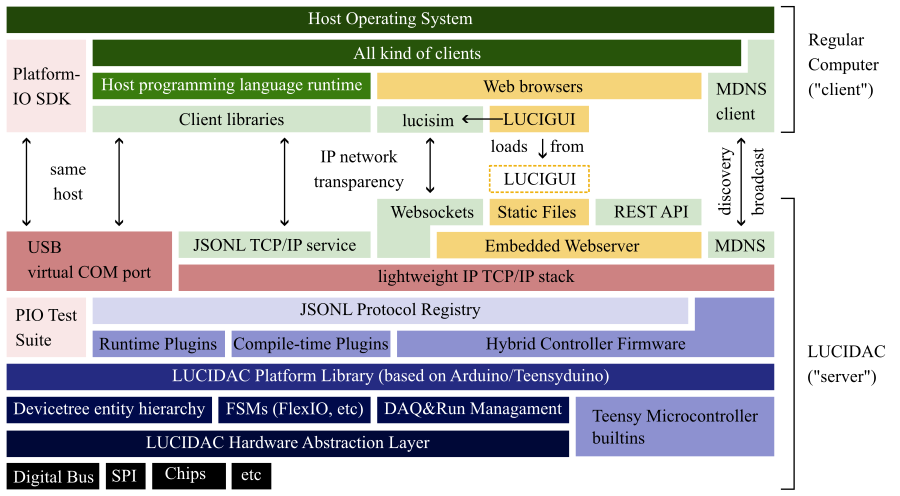

Hybrid Controller architecture
==============================

As most microcontroller appliances, also the hybrid controller is all about interfacing electronics
to the digital world. Therefore, the firmware is basically a big machinery to connect the analog
world with the digital one.

The foollowing figure gives an overview about the firmware architecture.

   Mode of communication. We also have a `PDF version of this figure <../figures/modes-of-communication.pdf>`_

The figure shall be proposed from bottom layers (close to analog) to top layers (far away from analog)

Hardware abstraction layer (HAL) and Platform Library
-----------------------------------------------------

At the heart of the firmware are routines to communicate with the chips built into LUCIDAC, in particular
over SPI. This is combined with a number of conceptual libraries for adressing the hierarchical hardware
(see also :ref:`entities`), for high speed control and memory moving (using
`NXP FlexIO <https://community.nxp.com/t5/Kinetis-Microcontrollers/Understanding-FlexIO/ta-p/1115419>`_),
basically MCU-integrated programmable logic) and others state managament code.

All this is wrapped up into the *Platform Library* which completes the C++ API to work with the LUCIDAC.
In principle this code could be used as standalone PlatformIO library, incorporating
a number of other dependencies from the Arduino universe.

Ontop of this library, we have experience with the following use cases:

* Direct exposure via the (Integration/Unit/etc) testing framework from PlatformIO. This provides
  a neat way to write small low-level codes directly as little firmware images.
* Remote Procedure Call (RPC) network interface via classical Marshalling/Serialization (see \ref protocol)
* Plugin codes provided by users and loaded at run-time or startup (compile-time).

Networking
----------

The IP networking (see :ref:`networking` for an introduction) is primarily provided by the
`QNEthernet <https://github.com/ssilverman/QNEthernet>`_ library. However, the RPC codes can also be used
over the virtual serial port (USB).

In terms of networking, the prefered way to communicate with the device is the JSONL TCP/IP service.
JSONL effectively is a thin packet-oriented layer ontop of the stream-oriented TCP connection.
It is very easy to come up with a client that can speak JSONL and we provide a number of implementations
in various languages.

The web stack
-------------

Primarily for novice users an embedded webserver is part of the firmware which serves a static image of
the *lucigui* client-side dynamical web software. Given the asymmetric nature of the RPC protocol,
websockets are used instead of raw TCP/IP streams. For simple queries, there is also a REST API.

In any way, the web stack has a somewhat experimental nature and can be, if neccessary, disabled by
:ref:`nvmconf`. The feature is by default not active in release 1.0.0.
